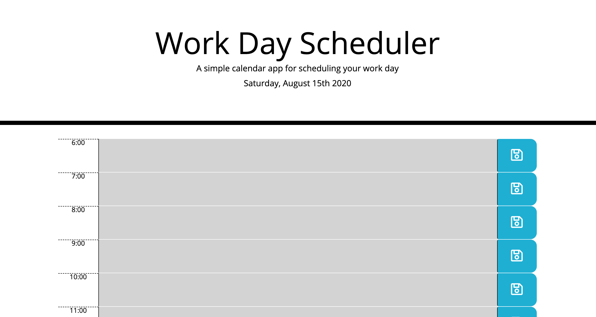

# workday-schedule-app
A daily schedule app using local storage to maintain saved events

## Overview

This app is a basic daily calendar, allowing the user to create and save events during the workday. This app was built using jQuery, Bootstrap, and Moment.js. 

## Features

Moment.js is used to set the date at the top of the calendar. It was also used to create color variation helping to designate the past, present, and future portions of the workday.

The user can store events in their local storage by pressing the "save" button.

## Deployed App

 https://egilbertsen.github.io/workday-schedule-app/
 
 
 
 
 

